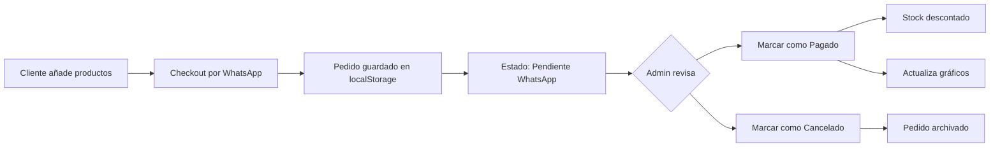

# 🛒 NovaMarket - Landing de Ventas con Admin

[](https://maiver4.github.io/Landig-Ventas/)
[](https://github.com/MaiVer4/Landig-Ventas)
[](LICENSE)

E-commerce moderno y completamente funcional con sistema de gestión de inventario y pedidos. Perfecto para negocios que desean vender por WhatsApp con un catálogo profesional.


## ✨ Características Principales

### 🏪 Tienda Online
- **Catálogo dinámico** con filtros por categorías
- **Sistema de ofertas** con descuentos y badges visuales
- **Carrito de compras** persistente (localStorage)
- **Checkout por WhatsApp** - Genera mensaje automático con el pedido
- **Responsive design** - Funciona perfecto en móviles y desktop
- **Formato de moneda colombiana** (COP)

### 👨‍💼 Panel de Administración
- **Dashboard con métricas** en tiempo real
- **Gestión de inventario** - CRUD completo de productos
- **Control de stock** - Alertas de productos por agotarse
- **Gestión de pedidos** - Marcar como pagado/cancelado
- **Gráficos de ventas** - Visualización por día/semana/mes/año
- **Sistema de categorías** - Crear y gestionar categorías personalizadas
- **Business Intelligence** - Insights automáticos sobre tu negocio
- **Exportación a CSV** - Descarga tu inventario

## 🚀 Demo en Vivo

**Tienda:** [https://maiver4.github.io/Landig-Ventas/](https://maiver4.github.io/Landig-Ventas/)

**Admin:** [https://maiver4.github.io/Landig-Ventas/admin.html](https://maiver4.github.io/Landig-Ventas/admin.html)

## 📸 Screenshots

<details>
<summary>Ver Capturas de Pantalla</summary>

### Tienda Principal


### Panel Admin - Dashboard


### Gestión de Pedidos


</details>

## 🛠️ Tecnologías

- **HTML5** - Estructura semántica
- **CSS3** - Diseño moderno y animaciones
- **JavaScript Vanilla** - Sin frameworks, código limpio
- **Font Awesome** - Iconos
- **Chart.js** - Gráficos interactivos
- **Tailwind CSS** (CDN) - Estilos del admin
- **localStorage API** - Persistencia de datos

## 📦 Instalación

### Opción 1: GitHub Pages (Recomendado)

1. **Fork este repositorio**
   ```bash
   # Haz clic en "Fork" en GitHub
   ```

2. **Activa GitHub Pages**
   - Ve a Settings → Pages
   - Source: Deploy from a branch
   - Branch: `main` → `/root`
   - Guarda los cambios

3. **Accede a tu sitio**
   ```
   https://TU-USUARIO.github.io/Landig-Ventas/
   ```

### Opción 2: Local

1. **Clona el repositorio**
   ```bash
   git clone https://github.com/MaiVer4/Landig-Ventas.git
   cd Landig-Ventas
   ```

2. **Abre con Live Server**
   ```bash
   # Con VSCode
   # Instala la extensión "Live Server"
   # Click derecho en index.html → "Open with Live Server"
   
   # O usa Python
   python -m http.server 8000
   
   # O Node.js
   npx serve
   ```

3. **Accede a la aplicación**
   ```
   http://localhost:8000
   ```

## ⚙️ Configuración

### 1. Número de WhatsApp

Edita `js/cart.js` línea 154:

```javascript
const phoneNumber = "573219395309"; // Cambia por tu número
```

### 2. Datos Iniciales

Edita `data/products.json` para personalizar tu catálogo:

```json
{
  "id": 1,
  "name": "Nombre del Producto",
  "description": "Descripción detallada",
  "price": 100000,
  "stock": 50,
  "category": "tecnologia",
  "image": "https://...",
  "isOffer": true,
  "discountPercent": 20
}
```

### 3. Credenciales Admin

Edita `js/admin.js` línea 88:

```javascript
if (user === 'admin' && pass === 'admin123') {
  // Cambia las credenciales aquí
}
```

### 4. Información de Contacto

Edita `index.html` líneas 119-123:

```html
<li><i class="fas fa-map-marker-alt"></i> Tu Ciudad, Colombia</li>
<li><i class="fas fa-phone"></i> +57 300 123 4567</li>
<li><i class="fas fa-envelope"></i> info@tutienda.com</li>
```

## 📚 Estructura del Proyecto

```
Landig-Ventas/
├── index.html              # Landing principal
├── admin.html              # Panel de administración
├── css/
│   └── styles.css          # Estilos globales
├── js/
│   ├── main.js            # Lógica de la tienda
│   ├── cart.js            # Sistema de carrito
│   └── admin.js           # Lógica del admin
├── data/
│   └── products.json      # Catálogo de productos
├── robots.txt             # SEO - Crawlers
├── sitemap.xml            # SEO - Mapa del sitio
└── README.md              # Esta documentación
```

## 🎯 Uso

### Para Clientes (Tienda)

1. **Navegar productos** por categorías
2. **Añadir al carrito** con el botón `+`
3. **Ver carrito** haciendo clic en el ícono superior derecho
4. **Ajustar cantidades** con `+` / `-`
5. **Checkout** → Se abre WhatsApp con el pedido

### Para Administradores (Admin)

1. **Acceder** a `admin.html`
2. **Iniciar sesión** con credenciales
3. **Dashboard** - Visualiza métricas generales
4. **Pedidos** - Gestiona pedidos de WhatsApp
   - Marcar como "Pagado" (descuenta stock automáticamente)
   - Marcar como "Cancelado"
5. **Inventario** - CRUD de productos
   - Crear, editar, eliminar productos
   - Control de stock en tiempo real
6. **Categorías** - Gestionar categorías de productos
7. **Inteligencia** - Ver análisis y recomendaciones

## 🔄 Flujo de Pedidos



## 📊 Características del Admin

### Dashboard
- Total de productos
- Valor total del inventario
- Alertas de stock bajo
- Gráfico de ventas (4 vistas temporales)
- Lista de productos por agotarse

### Gestión de Pedidos
- Tabla con todos los pedidos
- Filtro por estado (Pendiente/Pagado/Cancelado)
- Botones de acción rápida
- Validación de stock antes de confirmar pago
- Actualización automática de inventario

### Gestión de Productos
- Tabla con vista previa de imágenes
- Modal para crear/editar
- Soporte para ofertas y descuentos
- Control de stock
- Exportación a CSV

## 🔒 Seguridad

⚠️ **IMPORTANTE:** Esta es una demo educativa con autenticación básica del lado del cliente.

**Para producción:**
- Implementa autenticación real con backend
- Usa base de datos (Firebase, Supabase, etc.)
- Protege endpoints con JWT o OAuth
- No almacenes credenciales en el código fuente
- Implementa validación del lado del servidor

## 🌐 SEO Optimizado

✅ Meta tags completos (Title, Description, Keywords)
✅ Open Graph para redes sociales
✅ Twitter Cards
✅ Structured Data (JSON-LD Schema.org)
✅ robots.txt configurado
✅ sitemap.xml generado
✅ Semántica HTML5 correcta
✅ Accesibilidad (ARIA labels)

## 📱 Responsive Design

- ✅ Mobile First
- ✅ Tablet optimizado
- ✅ Desktop completo
- ✅ Menú hamburguesa móvil
- ✅ Carrito lateral adaptativo

## 🐛 Troubleshooting

### Los pedidos no aparecen en el admin

**Solución:** Asegúrate de acceder a la tienda y al admin desde el mismo dominio.

- ❌ Tienda: `https://maiver4.github.io/...` + Admin: `http://localhost:5500/admin.html`
- ✅ Tienda: `https://maiver4.github.io/...` + Admin: `https://maiver4.github.io/.../admin.html`

### Los productos no cargan

**Solución:** Verifica que `data/products.json` esté en la ruta correcta y sea JSON válido.

```bash
# Validar JSON
cat data/products.json | python -m json.tool
```

### El gráfico no se muestra

**Solución:** Asegúrate de que Chart.js se cargue correctamente desde el CDN.

```html
<script src="https://cdn.jsdelivr.net/npm/chart.js"></script>
```

## 🚀 Roadmap

- [ ] Backend con Node.js/Express
- [ ] Base de datos (MongoDB/PostgreSQL)
- [ ] Autenticación real (JWT)
- [ ] Pasarela de pagos (Mercado Pago/PayU)
- [ ] Panel de clientes
- [ ] Sistema de tracking de envíos
- [ ] Notificaciones push
- [ ] PWA (Progressive Web App)
- [ ] Modo offline
- [ ] Multi-idioma
- [ ] Sistema de cupones/descuentos

## 🤝 Contribuir

¡Las contribuciones son bienvenidas!

1. Fork el proyecto
2. Crea tu rama (`git checkout -b feature/AmazingFeature`)
3. Commit tus cambios (`git commit -m 'Add: AmazingFeature'`)
4. Push a la rama (`git push origin feature/AmazingFeature`)
5. Abre un Pull Request

## 📝 Licencia

Este proyecto está bajo la Licencia MIT - ver el archivo [LICENSE](LICENSE) para más detalles.

## 👤 Autor

**MaiVer4**

- GitHub: [@MaiVer4](https://github.com/MaiVer4)
- Proyecto: [Landig-Ventas](https://github.com/MaiVer4/Landig-Ventas)

## 🙏 Agradecimientos

- [Font Awesome](https://fontawesome.com) - Iconos
- [Chart.js](https://www.chartjs.org) - Gráficos
- [Tailwind CSS](https://tailwindcss.com) - Framework CSS
- [Unsplash](https://unsplash.com) - Imágenes de ejemplo

## 📞 Soporte

¿Necesitas ayuda? 

- 🐛 [Reportar un bug](https://github.com/MaiVer4/Landig-Ventas/issues)
- 💡 [Solicitar una feature](https://github.com/MaiVer4/Landig-Ventas/issues)
- 📧 Contacto: [Crear issue](https://github.com/MaiVer4/Landig-Ventas/issues/new)

---

⭐ **Si este proyecto te fue útil, dale una estrella en GitHub!** ⭐

Hecho con ❤️ por [MaiVer4](https://github.com/MaiVer4)
